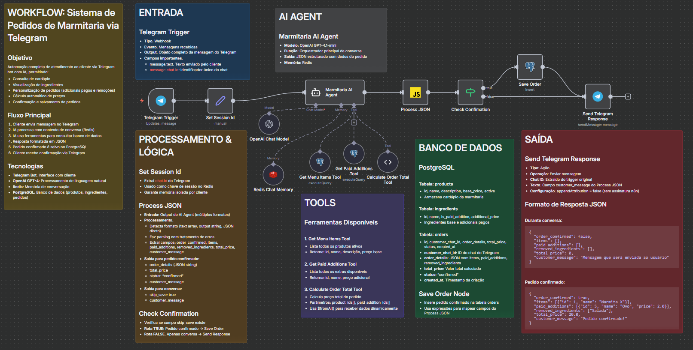

# Sistema de Atendimento Automatizado para Marmitaria

Sistema de atendimento inteligente via Telegram Bot utilizando IA generativa para automatizar pedidos de uma marmitaria.

## Acesse o Bot

**Link do Telegram:** https://t.me/the_marmitaria_bot

## Sobre o Projeto

Este projeto implementa um agente de IA capaz de realizar atendimento completo de clientes, desde a apresentação do cardápio até a confirmação e registro do pedido. O sistema foi desenvolvido usando N8N como plataforma de automação e integra inteligência artificial para processamento de linguagem natural.

## Funcionalidades

O agente de IA é capaz de:

1. **Apresentar o cardápio** - Mostra todos os produtos disponíveis com descrição e preços de forma clara
2. **Aceitar personalizações** - Permite que o cliente personalize seu pedido:
   - Adicionar extras pagos (ovo frito, bacon, queijo, etc.)
   - Remover ingredientes indesejados (sem salada, sem cebola, etc.)
3. **Calcular preços automaticamente** - Calcula o valor total incluindo adicionais pagos
4. **Confirmar pedidos** - Revisa todo o pedido com o cliente antes de finalizar
5. **Registrar pedidos** - Salva cada pedido com todas as informações em banco de dados

## Arquitetura Técnica

### Tecnologias Utilizadas

- **N8N** - Plataforma de automação de workflows
- **OpenAI GPT-4** - Modelo de IA para processamento de linguagem natural
- **Telegram Bot API** - Interface de comunicação com clientes
- **PostgreSQL** - Banco de dados para produtos, ingredientes e pedidos
- **Redis** - Memória de conversação para manter contexto entre mensagens

### Estrutura do Workflow



O workflow completo está disponível no arquivo `MarmitariaAIAgentWorkflowFinal.json` e pode ser importado diretamente no N8N.

### Fluxo de Atendimento

1. Cliente envia mensagem via Telegram
2. Sistema identifica a sessão do usuário (mantém contexto da conversa)
3. IA processa a mensagem usando ferramentas disponíveis:
   - Consulta ao cardápio
   - Consulta de adicionais pagos
   - Cálculo de preços
4. Sistema processa a resposta da IA e extrai informações estruturadas
5. Se o pedido for confirmado, salva no banco de dados
6. Cliente recebe resposta personalizada via Telegram

### Banco de Dados

O sistema utiliza PostgreSQL com três tabelas principais:

**products**
- Armazena o cardápio completo com nome, descrição e preço base

**ingredients**
- Armazena ingredientes e adicionais pagos disponíveis

**orders**
- Registra cada pedido confirmado com:
  - ID do cliente (chat do Telegram)
  - Detalhes do pedido (itens, adicionais, remoções)
  - Valor total
  - Status
  - Data e hora

#### Configuração do Banco de Dados

Para configurar o banco de dados PostgreSQL:

1. **Execute as migrations** - Criar as tabelas necessárias:
   ```bash
   psql -U seu_usuario -d sua_database -f migrations/001_create_tables.sql
   ```

2. **Execute os seeds** - Popular com dados iniciais (cardápio e ingredientes):
   ```bash
   psql -U seu_usuario -d sua_database -f seeds/001_initial_data.sql
   ```

Os arquivos SQL estão organizados em:
- `migrations/` - Scripts de criação de estrutura do banco
- `seeds/` - Scripts de população inicial de dados

## Como Testar

1. Acesse o bot no Telegram: https://t.me/the_marmitaria_bot
2. Inicie uma conversa com `/start` ou qualquer mensagem
3. Solicite o cardápio
4. Faça seu pedido com personalizações
5. Confirme o pedido final

### Exemplos de Conversa

**Exemplo 1 - Pedido Simples**
```
Cliente: Oi
Bot: Olá! Bem-vindo à nossa marmitaria. Gostaria de ver o cardápio?
Cliente: Sim, por favor
Bot: [Mostra cardápio completo]
Cliente: Quero a marmita executiva
Bot: Ótima escolha! Gostaria de adicionar algum extra?
Cliente: Não, pode confirmar
Bot: Pedido confirmado! Marmita Executiva - R$ 18,00
```

**Exemplo 2 - Pedido com Personalizações**
```
Cliente: Quero uma marmita fitness
Bot: Ótima escolha! Gostaria de personalizar?
Cliente: Quero adicionar ovo frito e sem salada
Bot: Perfeito! Marmita Fitness + ovo frito (sem salada) = R$ 22,00. Confirma?
Cliente: Sim
Bot: Pedido confirmado!
```

## Estrutura de Arquivos

```
marmitaria_n8n/
├── README.md                               # Documentação do projeto
├── MarmitariaAIAgentWorkflowFinal.json    # Workflow N8N completo
├── workflowMarmitariaFull.png             # Imagem do fluxo
├── migrations/
│   └── 001_create_tables.sql              # Script de criação de tabelas
└── seeds/
    └── 001_initial_data.sql               # Dados iniciais (cardápio e ingredientes)
```

## Importar o Workflow

Para usar este projeto em sua própria instância N8N:

### 1. Configure o Banco de Dados

Execute os scripts SQL para criar as tabelas e popular dados iniciais:

```bash
# Criar tabelas
psql -U seu_usuario -d sua_database -f migrations/001_create_tables.sql

# Popular dados iniciais
psql -U seu_usuario -d sua_database -f seeds/001_initial_data.sql
```

### 2. Importe o Workflow no N8N

1. Abra seu N8N
2. Vá em "Workflows" > "Import from File"
3. Selecione o arquivo `MarmitariaAIAgentWorkflowFinal.json`

### 3. Configure as Credenciais

Configure as seguintes credenciais no N8N:
- **Telegram Bot Token** - Crie um bot no @BotFather do Telegram
- **OpenAI API Key** - Obtenha em https://platform.openai.com/api-keys
- **PostgreSQL** - Configure host, database, user e password
- **Redis** - Configure host, port e password (opcional)

## Observações

- O sistema mantém contexto de conversa usando Redis, permitindo interações naturais
- Cada cliente tem sua própria sessão isolada identificada pelo chat ID do Telegram
- Remoções de ingredientes não alteram o preço, apenas adicionais pagos
- Todos os pedidos confirmados são salvos com timestamp para consulta posterior
